# Conditional VAE + CLIP for text to image generation

based on https://github.com/EleMisi/ConditionalVAE

## colab

[link to notebook](https://colab.research.google.com/drive/1xWb7jvSiUheJjo6RdNvexpEWGPmG3c5k?usp=sharing)

## if using colab, install these packages

- pip install ftfy regex tqdm
- pip install git+https://github.com/openai/CLIP.git

## if not using colab, setup a conda env

- conda create -n tf -c conda-forge tensorflow-gpu python=3.7 &&conda activate tf
- pip install kaggle
- pip install pandas
- pip install matplotlib
- python3 -m pip install opencv-python
- pip install ftfy regex tqdm
- pip install git+https://github.com/openai/CLIP.git

## download the dataset

- add `kaggle.json` ([how to get this file](https://www.kaggle.com/general/156610)) to src
- cd to src
- run `bash setup_kaggle.sh`
- run `python dataloader.py`
- the data will be stored in `input` folder
- if your data is in another folder set the path at celeba.get_images
- if you use resized images, adjust celeba.preprocess_image because it will crop and resize the image again.

## generate CLIP embeddings for the dataset

- go to `src/generate_clip_embedings.py`, go to the main function set the number of images that you want to create
  embeddings for. If you want to do it for the whole dataset set `size=None`
- alternatively, run `python src/generate_clip_embeddings_lm.py 128` with 128 as the desired number of embeddings. you
  may choose another number. if no number is specified, it will embed all images in the dataset (>202,000).
- You will get `embeddings.csv` (1.7 GB)
- A small version is already included in the repo
    - `src/embeddings_128.csv`

## download model checkpoint

- model name = "2022-07-30_14.36.29"
- `gdown https://drive.google.com/uc?id=1P1z0Jl_wND6mqR73QSZ59bDxPO7IEX1P`
- `unzip -q 2022-07-30_14.36.29.zip -d ./`
- put it in "checkpoints" folder, `mv 2022-07-30_14.36.29 checkpoints/`
- more checkpoints are listed below

## train the model

- go to `src/train.py`
- set `n_epochs = [number]`
- set `save_model_every = [number]`
- set `pretrained_model = "2022-07-30_14.36.29"`, set to `None` if you want to train a new model
- set `embedding_path = "embeddings.csv"` (full dataset)
- set `run_train = True`
    - the model will be saved in `checkpoints` folder

## image generation

- go to `src/train.py`
- set `pretrained_model = "2022-07-30_14.36.29"` (or another checkpoint)
- set `run_train = False`
- set `embedding_path = "embeddings_128.csv"`
- set `test_size = 32`
- go to the main function at the bottom, choose the functions you want to run (you can run all)
- set `save_at = result_folder` (save images to the model result folder)

### functions to generate images

- `plot_recon_images()` : plot reconstruction on the test batch

- `plot_ori_images()` : plot original test images

- `generate_image_given_text(target_attr="wear reading glasses and smile")`: generate image given a text prompt

| example            |  example |
:-------------------------:|:-------------------------:
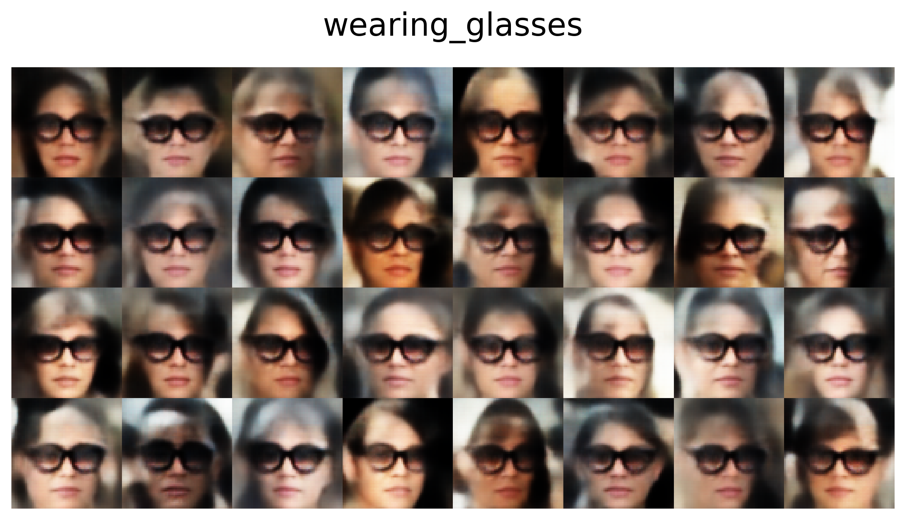| 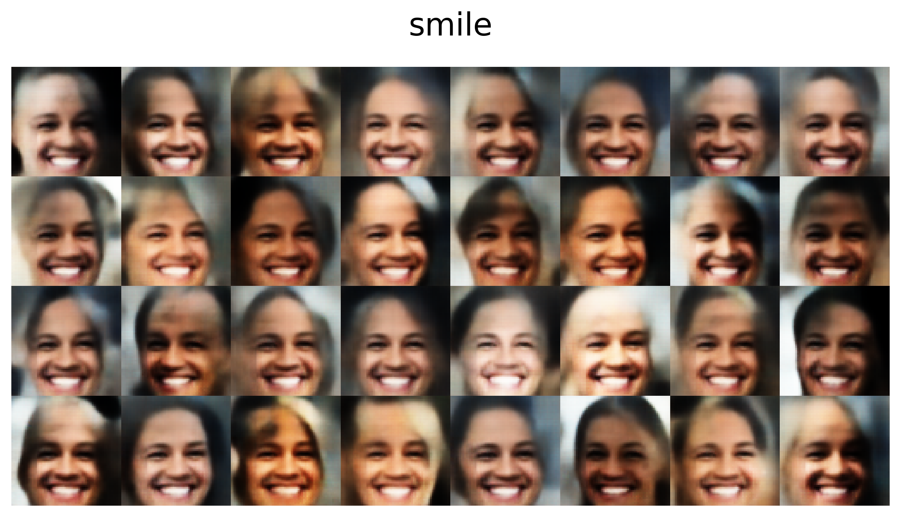
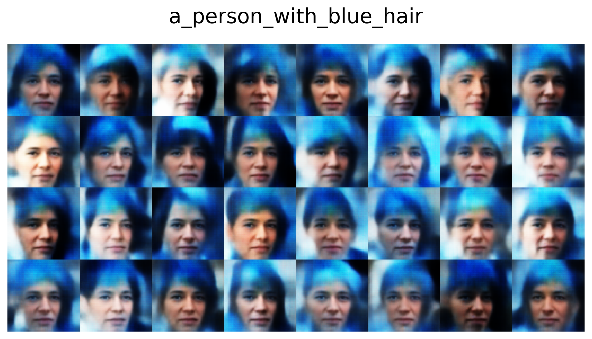| 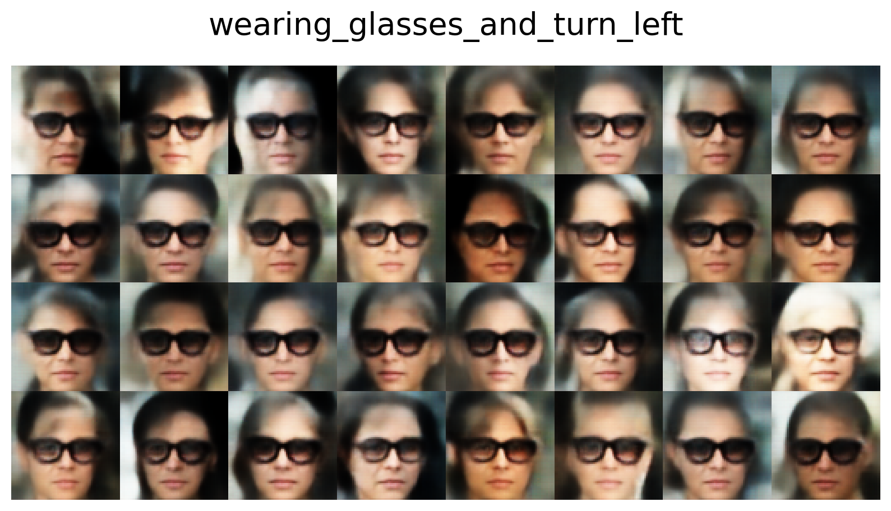

- `generate_image_given_text(target_attr=None)`: generate image (condition are the image embeddings from test set)
  

| original            |  example |
:-------------------------:|:-------------------------:
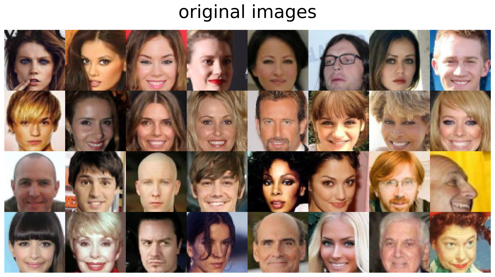 | 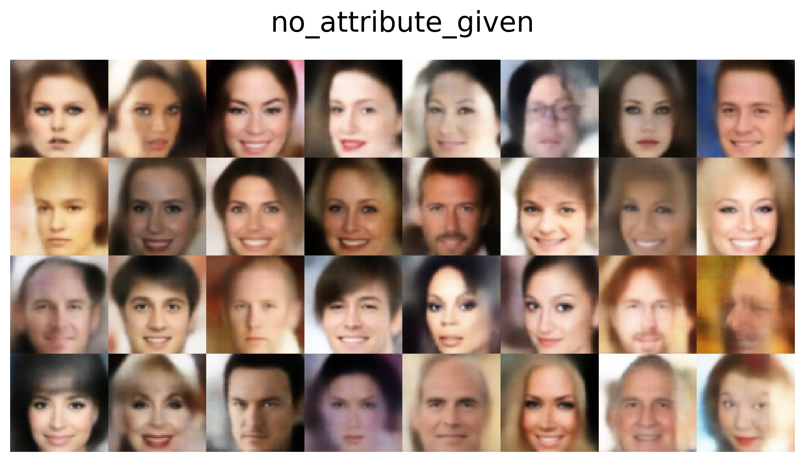

- `plot_image_with_attr(target_attr="angry", image_embed_factor=0.6)`: attribute manipulation
  

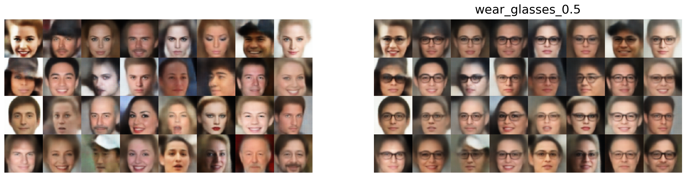

- `plot_attr_manipulation_interpolation(target_attr="wear glasses",num_images=3)`: attribute manipulation interpolation
  for 3 images
    - if num_images is None, interpolation plot for 32 images will be created (you probably may not want to run it
      because it will take a long time)

| example            |  example |
:-------------------------:|:-------------------------:
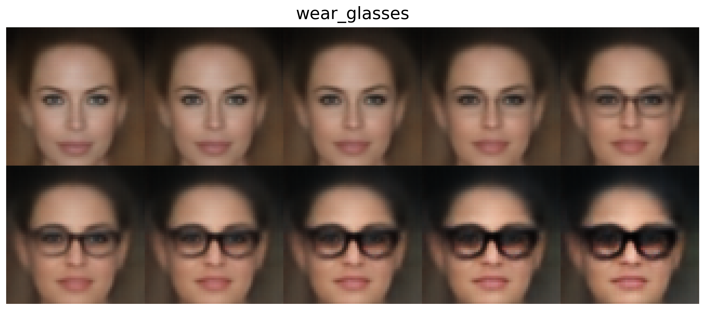|  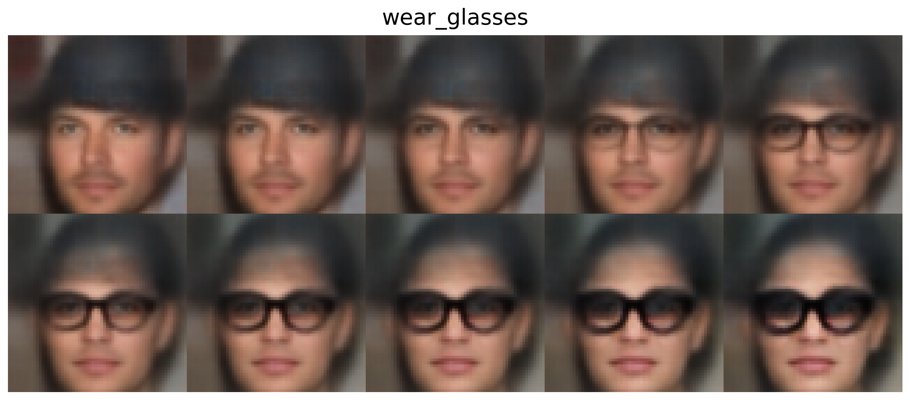
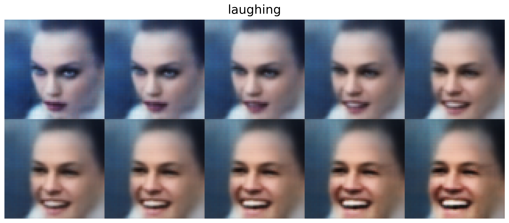|  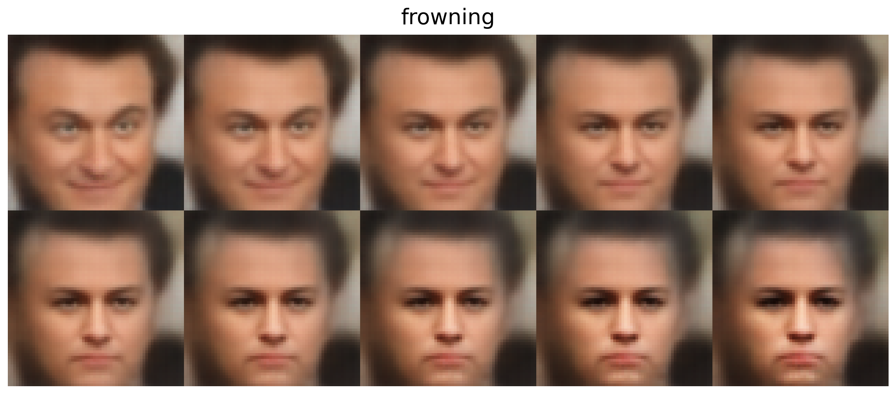
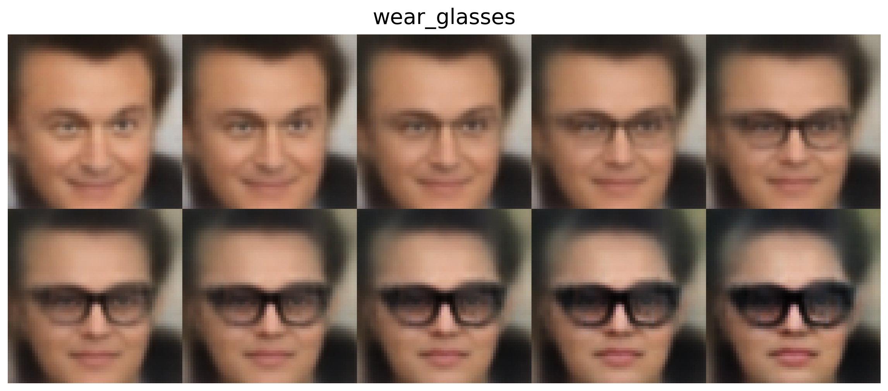 |  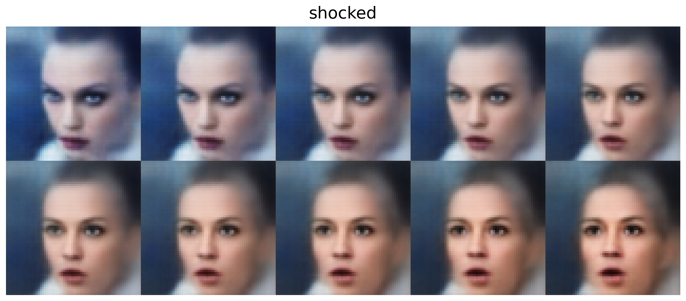
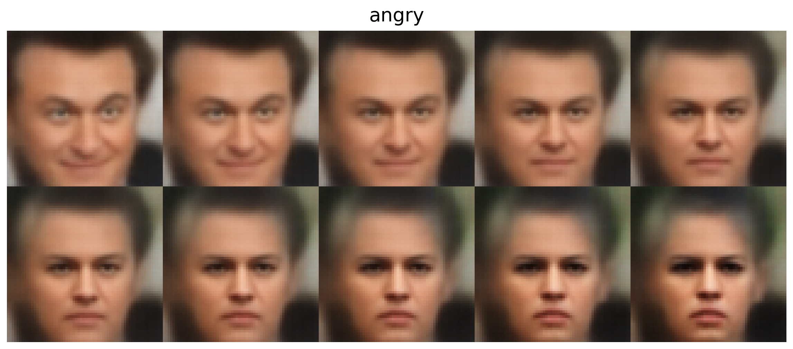  | 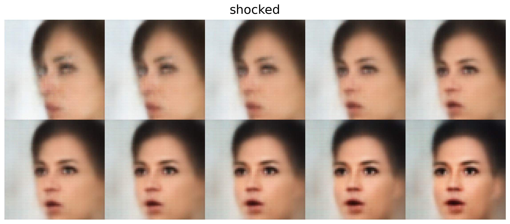

## etc

- check the gpu run `src/check_gpu.py`

## model architecture

- input: image tensor (batch,64, 64, 3), condition/CLIP image embeddings (batch, 1,1, 512)
- output: image tensor (batch,64, 64, 3)

### VAE (conditional VAE 1)

- encoder:
    - block1: Conv2D, BatchNormalization, Leaky Relu
    - block2: Conv2D, BatchNormalization, Leaky Relu
    - block3: Conv2D, BatchNormalization, Leaky Relu
    - block4: Conv2D, BatchNormalization, Leaky Relu
    - flatten -> dense
    - output: mean, log variance
- re-parametrization:
    - takes mean, log variance and output z (latent space)
    - z concatenated with the condition -> output
- decoder:
    - take z + condition
    - dense -> Leaky Relu
    - block1: Conv2DTranspose, BatchNormalization, Leaky Relu
    - block2: Conv2DTranspose, BatchNormalization, Leaky Relu
    - block3: Conv2DTranspose, BatchNormalization, Leaky Relu
    - block4: Conv2DTranspose, BatchNormalization, Leaky Relu
    - block4: Conv2DTranspose -> sigmoid
    - output: image batch (batch,64,64,3)

### loss

- loss = reconstruction loss + (beta * latent loss)
- latent loss
    - KL divergence
    - computed using mean and log var
- reconstruction loss
    - over weighted MSE
    - use binary cross-entropy on real image and reconstructed image

## model variation

- **base model**: unconditional VAE, the input is just an image tensor
- **conditional VAE 1**: input to the encoder is image concatenated with the condition
    - ConvolutionalCondVAE.py
    - good result
    - this is the best architecture
- **conditional VAE 2**: input to the encoder is the image tensor, the condition is added as additional channel in the
  last of the encoder (after block 4, before dense, when the tensor size is 4 x 4)
    - ConvolutionalCondVAE.py
    - result is similar to conditional VAE 1
- **conditional VAE 1 + attention layers**
    - does not give good result, gives rather blurry images
    - [see](src/results/result_2022-08-02_12.53.05_attention)
- **conditional VAE 1 + additional Conv2D block** (block 5, 6)
    - ConvolutionalCondVAE_2.py
    - result is worse than conditional VAE 1, but not very bad

## checkpoints

- 2022-07-30_14.36.29 (**best model**)
    - model: conditional VAE 1 (add condition to the input)
    - result: good
    - epoch: 30, result from epoch 20 is already good
    - params
        - latent_dim = 128
        - batch_size = 32
    - [download zip](https://drive.google.com/file/d/1aOEH-GT0YE_H0E03Not4q70CxWAy6701/view?usp=sharing)
    - or `gdown https://drive.google.com/uc?id=1aOEH-GT0YE_H0E03Not4q70CxWAy6701`
- 2022-08-07_01.14.16 (**best model**)
    - try to replicate 2022-07-30_14.36.29
    - result: similar to 2022-07-30_14.36.29
    - model: conditional VAE 1
    - epoch: 25
    - params
        - latent_dim = 128
        - batch_size = 32
    - time: 326 min
    - [download zip](https://drive.google.com/file/d/197sMsC6_2G6lmftlXp7ar91EXu16PzG-/view?usp=sharing)
    - or `gdown https://drive.google.com/uc?id=197sMsC6_2G6lmftlXp7ar91EXu16PzG-`
- 2022-08-07_14.33.03
    - result: similar to 2022-08-07_01.14.16, color is not intense, more blur
    - model: conditional VAE 2 (add condition in later layer)
    - epoch: 25
    - params
        - batch_size = 32
        - latent_dim = 128
    - time: 231 min
    - [download zip](https://drive.google.com/file/d/1XTN-qOaJD00fGJJaq4Ir42tQh21sUocG/view?usp=sharing)
    - or `gdown https://drive.google.com/uc?id=1XTN-qOaJD00fGJJaq4Ir42tQh21sUocG`
- 2022-08-07_14.37.18
    - model: conditional VAE 1 + additional Conv2D block (block 5, 6)
    - result: similar to 2022-08-07_01.14.16
    - epoch: 20
    - params
        - batch_size = 32
        - latent_dim = 128
    - time: 249 min
    - [download zip](https://drive.google.com/file/d/10dsnOvlziCFm10QdwBjFW0OzNm_YnoRs/view?usp=sharing)
    - or `gdown https://drive.google.com/uc?id=10dsnOvlziCFm10QdwBjFW0OzNm_YnoRs`

- 2022-08-08_12.19.07
    - model: conditional VAE 1 (increase latent dim to 256)
    - result: ....
    - epoch: 25
    - params
        - batch_size = 32
        - latent_dim = **256**
    - time: 363 min
    - [download zip](https://drive.google.com/file/d/1mo7j57tcTI9TNPAuo_F2yIED2-jQQZsF/view?usp=sharing)
    - or `gdown https://drive.google.com/uc?id=1mo7j57tcTI9TNPAuo_F2yIED2-jQQZsF`

### How to load the pre-trained model

- In `train.py`, set `pretrained_model = <model folder>` such as `"2022-08-07_01.14.16"`, it will load the latest
  checkpoint of that model.
- Each model folder consists of multiple checkpoints (we saved the model every 5 epoch).
- To use a specific checkpoint, set e.g. `checkpoint_path = "./checkpoints/2022-07-30_14.36.29/model-5"`
- Go to the model folder and see which model do you have available

